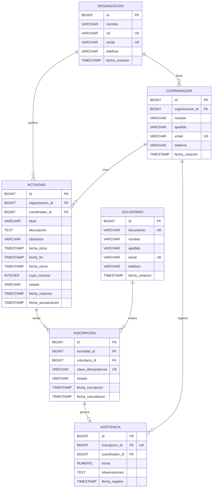

# ProyectoBackend

Backend para la **Gestión de voluntariado comunitario**: publica actividades, gestiona inscripciones y registra asistencia respetando cupos y fechas.

---

## Tecnologías

| Tecnología              | Versión / detalle                          |
|-------------------------|--------------------------------------------|
| Java                    | 21                                         |
| Spring Boot             | 4.1.1                                      |
| Spring Web MVC          | API REST                                   |
| Spring Data JPA         | Persistencia (Hibernate)                   |
| PostgreSQL              | Base de datos `DaMano_db`                  |
| Maven                   | Usar el wrapper incluido: `./mvnw`         |

## Estado del proyecto

Seguimiento de lo implementado y lo pendiente. Actualizar esta tabla con cada avance.

| Componente                                         | Estado        | Detalle                                                              |
|----------------------------------------------------|---------------|----------------------------------------------------------------------|
| Endpoint de estado (`GET /api/estado`)             | Hecho     | Verifica que la API está disponible.                                 |
| Dependencias de persistencia (JPA + PostgreSQL)    | Hecho     | Agregadas en `pom.xml`.                                              |
| Modelo relacional de la base de datos              | Hecho     | Ver [Modelo de base de datos relacional](#modelo-de-base-de-datos-relacional). |
| Entidades JPA con relaciones `@ManyToOne`          | Hecho     | Ver [Implementación de entidades JPA](#implementación-de-entidades-jpa). |
| Conexión a `DaMano_db` en `application.properties` | Pendiente | Sin ella la aplicación no arranca (JPA exige un datasource).         |
| Repositorios (`JpaRepository`)                     | Pendiente |                                                                      |
| Servicios con reglas de negocio (RN-01 a RN-06)    | Pendiente |                                                                      |
| Controladores del contrato HTTP                    | Pendiente | `/api/actividades`, `/api/inscripciones`.                            |
| DTOs de petición y respuesta                       | Pendiente |                                                                      |

## Estructura del proyecto

```
src/main/java/co/edu/autonoma/reservasapi/
├── ProyectoBackendApplication.java   # Clase principal de Spring Boot
├── controller/
│   └── EstadoController.java         # GET /api/estado
├── service/
│   └── EstadoServicio.java           # Lógica del endpoint de estado
└── dto/
    ├── EstadoResponse.java           # Respuesta del endpoint de estado (record)
    ├── OrganizacionEntity.java       # Entidad JPA → tabla organizacion
    ├── CoordinadorEntity.java        # Entidad JPA → tabla coordinador
    ├── VoluntarioEntity.java         # Entidad JPA → tabla voluntario
    ├── ActividadEntity.java          # Entidad JPA → tabla actividad
    ├── InscripcionEntity.java        # Entidad JPA → tabla inscripcion
    ├── AsistenciaEntity.java         # Entidad JPA → tabla asistencia
    ├── EstadoActividad.java          # Enum: estados de una actividad
    └── EstadoInscripcion.java        # Enum: estados de una inscripción
```

> Las entidades JPA están en el paquete `dto` por decisión del proyecto. Para distinguirlas de los DTOs de petición/respuesta, **toda entidad termina en `Entity`**.

## Endpoints implementados

| Verbo | Ruta          | Descripción                          | Respuesta de ejemplo                                   |
|-------|---------------|--------------------------------------|--------------------------------------------------------|
| GET   | `/api/estado` | Indica si la API está disponible.    | `{"servicio": "DaMano-api", "estado": "disponible"}`   |

---

## Modelo de base de datos relacional

- **Motor:** PostgreSQL
- **Base de datos:** `DaMano_db`

### Entidades

| Entidad          | Tipo                  | Descripción                                                                                   |
|------------------|-----------------------|-----------------------------------------------------------------------------------------------|
| `organizacion`   | Fuerte                | Organización comunitaria que publica actividades y consulta la participación en ellas.       |
| `coordinador`    | Fuerte                | Usuario que pertenece a una organización, crea actividades y registra asistencia.            |
| `voluntario`     | Fuerte                | Usuario que consulta actividades y se inscribe en ellas.                                     |
| `actividad`      | Fuerte                | Actividad de voluntariado con cupo y fecha de cierre de inscripción.                         |
| `inscripcion`    | Débil (asociativa)    | Resuelve la relación N:M entre `voluntario` y `actividad`. No existe sin ambos.             |
| `asistencia`     | Débil                 | Registro de asistencia y horas de una inscripción confirmada. No existe sin la inscripción.  |

### Atributos

> **PK** = Clave primaria · **FK** = Clave foránea · **UQ** = Único · **NN** = No nulo

#### `organizacion`

| Atributo         | Tipo de dato   | Restricciones        | Descripción                         |
|------------------|----------------|----------------------|-------------------------------------|
| `id`             | `BIGINT`       | **PK**, identidad    | Identificador de la organización.   |
| `nombre`         | `VARCHAR(150)` | NN                   | Nombre de la organización.          |
| `nit`            | `VARCHAR(20)`  | NN, UQ               | Identificación tributaria.          |
| `email`          | `VARCHAR(150)` | NN, UQ               | Correo de contacto.                 |
| `telefono`       | `VARCHAR(20)`  |                      | Teléfono de contacto.               |
| `fecha_creacion` | `TIMESTAMP`    | NN, default `NOW()`  | Fecha de registro.                  |

#### `coordinador`

| Atributo          | Tipo de dato   | Restricciones                        | Descripción                         |
|-------------------|----------------|--------------------------------------|-------------------------------------|
| `id`              | `BIGINT`       | **PK**, identidad                    | Identificador del coordinador.      |
| `organizacion_id` | `BIGINT`       | **FK** → `organizacion(id)`, NN      | Organización a la que pertenece.    |
| `nombre`          | `VARCHAR(100)` | NN                                   | Nombres.                            |
| `apellido`        | `VARCHAR(100)` | NN                                   | Apellidos.                          |
| `email`           | `VARCHAR(150)` | NN, UQ                               | Correo electrónico.                 |
| `telefono`        | `VARCHAR(20)`  |                                      | Teléfono.                           |
| `fecha_creacion`  | `TIMESTAMP`    | NN, default `NOW()`                  | Fecha de registro.                  |

#### `voluntario`

| Atributo         | Tipo de dato   | Restricciones        | Descripción                         |
|------------------|----------------|----------------------|-------------------------------------|
| `id`             | `BIGINT`       | **PK**, identidad    | Identificador del voluntario.       |
| `documento`      | `VARCHAR(20)`  | NN, UQ               | Documento de identidad.             |
| `nombre`         | `VARCHAR(100)` | NN                   | Nombres.                            |
| `apellido`       | `VARCHAR(100)` | NN                   | Apellidos.                          |
| `email`          | `VARCHAR(150)` | NN, UQ               | Correo electrónico.                 |
| `telefono`       | `VARCHAR(20)`  |                      | Teléfono.                           |
| `fecha_creacion` | `TIMESTAMP`    | NN, default `NOW()`  | Fecha de registro.                  |

#### `actividad`

| Atributo              | Tipo de dato   | Restricciones                                                    | Descripción                                         |
|-----------------------|----------------|------------------------------------------------------------------|-----------------------------------------------------|
| `id`                  | `BIGINT`       | **PK**, identidad                                                | Identificador de la actividad.                      |
| `organizacion_id`     | `BIGINT`       | **FK** → `organizacion(id)`, NN                                  | Organización que publica la actividad.              |
| `coordinador_id`      | `BIGINT`       | **FK** → `coordinador(id)`, NN                                   | Coordinador que crea la actividad.                  |
| `titulo`              | `VARCHAR(150)` | NN                                                               | Título.                                             |
| `descripcion`         | `TEXT`         |                                                                  | Descripción.                                        |
| `ubicacion`           | `VARCHAR(200)` | NN                                                               | Lugar donde se realiza.                             |
| `fecha_inicio`        | `TIMESTAMP`    | NN                                                               | Inicio de la actividad.                             |
| `fecha_fin`           | `TIMESTAMP`    | NN, `CHECK (fecha_fin > fecha_inicio)`                           | Fin de la actividad.                                |
| `fecha_cierre`        | `TIMESTAMP`    | NN, `CHECK (fecha_cierre <= fecha_inicio)`                       | Fecha de cierre de inscripciones (RN-03).           |
| `cupo_maximo`         | `INTEGER`      | NN, `CHECK (cupo_maximo > 0)`                                    | Cupo total de voluntarios (RN-01).                  |
| `estado`              | `VARCHAR(20)`  | NN, `CHECK IN ('ABIERTA','CERRADA','CANCELADA','FINALIZADA')`    | Estado de la actividad.                             |
| `fecha_creacion`      | `TIMESTAMP`    | NN, default `NOW()`                                              | Fecha de creación.                                  |
| `fecha_actualizacion` | `TIMESTAMP`    | NN, default `NOW()`                                              | Última modificación (trazabilidad).                 |

#### `inscripcion`

| Atributo             | Tipo de dato   | Restricciones                                       | Descripción                                                   |
|----------------------|----------------|-----------------------------------------------------|---------------------------------------------------------------|
| `id`                 | `BIGINT`       | **PK**, identidad                                   | Identificador de la inscripción.                              |
| `actividad_id`       | `BIGINT`       | **FK** → `actividad(id)`, NN                        | Actividad a la que se inscribe.                               |
| `voluntario_id`      | `BIGINT`       | **FK** → `voluntario(id)`, NN                       | Voluntario inscrito.                                          |
| `clave_idempotencia` | `VARCHAR(100)` | NN, UQ                                              | Clave enviada por el cliente para no duplicar (RN-06).        |
| `estado`             | `VARCHAR(20)`  | NN, `CHECK IN ('CONFIRMADA','CANCELADA')`           | Estado de la inscripción.                                     |
| `fecha_inscripcion`  | `TIMESTAMP`    | NN, default `NOW()`                                 | Fecha en que se inscribió.                                    |
| `fecha_cancelacion`  | `TIMESTAMP`    |                                                     | Fecha de cancelación (cancelación lógica, trazabilidad).      |

#### `asistencia`

| Atributo          | Tipo de dato    | Restricciones                               | Descripción                                           |
|-------------------|-----------------|---------------------------------------------|-------------------------------------------------------|
| `id`              | `BIGINT`        | **PK**, identidad                           | Identificador de la asistencia.                       |
| `inscripcion_id`  | `BIGINT`        | **FK** → `inscripcion(id)`, NN, UQ          | Inscripción confirmada a la que corresponde (RN-04).  |
| `coordinador_id`  | `BIGINT`        | **FK** → `coordinador(id)`, NN              | Coordinador que registra la asistencia.               |
| `horas`           | `NUMERIC(5,2)`  | NN, `CHECK (horas > 0)`                     | Horas de voluntariado realizadas (RN-05).             |
| `observaciones`   | `TEXT`          |                                             | Observaciones del coordinador.                        |
| `fecha_registro`  | `TIMESTAMP`     | NN, default `NOW()`                         | Fecha en que se registró la asistencia.               |

### Claves primarias y foráneas

| Tabla          | Clave primaria | Clave foránea      | Referencia          |
|----------------|----------------|--------------------|---------------------|
| `organizacion` | `id`           | —                  | —                   |
| `coordinador`  | `id`           | `organizacion_id`  | `organizacion(id)`  |
| `voluntario`   | `id`           | —                  | —                   |
| `actividad`    | `id`           | `organizacion_id`  | `organizacion(id)`  |
|                |                | `coordinador_id`   | `coordinador(id)`   |
| `inscripcion`  | `id`           | `actividad_id`     | `actividad(id)`     |
|                |                | `voluntario_id`    | `voluntario(id)`    |
| `asistencia`   | `id`           | `inscripcion_id`   | `inscripcion(id)`   |
|                |                | `coordinador_id`   | `coordinador(id)`   |

### Relaciones

| Relación                              | Cardinalidad | Descripción                                                                                   |
|---------------------------------------|--------------|-----------------------------------------------------------------------------------------------|
| `organizacion` → `coordinador`        | 1 : N        | Una organización tiene muchos coordinadores; un coordinador pertenece a una organización.     |
| `organizacion` → `actividad`          | 1 : N        | Una organización publica muchas actividades; una actividad pertenece a una organización.     |
| `coordinador` → `actividad`           | 1 : N        | Un coordinador crea muchas actividades; una actividad es creada por un coordinador.          |
| `actividad` → `inscripcion`           | 1 : N        | Una actividad recibe muchas inscripciones; una inscripción es de una sola actividad.         |
| `voluntario` → `inscripcion`          | 1 : N        | Un voluntario tiene muchas inscripciones; una inscripción es de un solo voluntario.          |
| `voluntario` ↔ `actividad`            | N : M        | Resuelta mediante la entidad asociativa `inscripcion`.                                       |
| `inscripcion` → `asistencia`          | 1 : 0..1     | Una inscripción tiene como máximo un registro de asistencia.                                 |
| `coordinador` → `asistencia`          | 1 : N        | Un coordinador registra muchas asistencias.                                                  |

### Diagrama entidad-relación



### Reglas de negocio reflejadas en el modelo

| Regla | Cómo se soporta                                                                                                                                                  |
|-------|------------------------------------------------------------------------------------------------------------------------------------------------------------------|
| RN-01 | `actividad.cupo_maximo` con `CHECK > 0`. El servicio cuenta las inscripciones `CONFIRMADA` antes de insertar, bloqueando la actividad (`SELECT ... FOR UPDATE`). |
| RN-02 | Índice único parcial `(actividad_id, voluntario_id) WHERE estado = 'CONFIRMADA'`: solo puede existir una inscripción activa por voluntario y actividad.          |
| RN-03 | `actividad.fecha_cierre` y `actividad.estado`. El servicio rechaza la inscripción si `NOW() > fecha_cierre` o si el cupo está completo (pasa a `CERRADA`).       |
| RN-04 | `asistencia.inscripcion_id` es FK y único. El servicio valida que la inscripción esté en estado `CONFIRMADA` antes de registrar.                                 |
| RN-05 | `asistencia.horas` con `CHECK (horas > 0)`.                                                                                                                      |
| RN-06 | `inscripcion.clave_idempotencia` única: si se repite la petición con la misma clave, se devuelve la inscripción ya creada en lugar de crear otra.               |

> **Trazabilidad:** las inscripciones no se borran físicamente; `DELETE /api/inscripciones/{id}` cambia el estado a `CANCELADA` y guarda `fecha_cancelacion`.

---

## Implementación de entidades JPA

Cada tabla del modelo relacional tiene una clase Java anotada con `@Entity` en el paquete `co.edu.autonoma.reservasapi.dto`.

### Clase ↔ tabla

| Clase Java              | Tabla          | Relaciones `@ManyToOne`                                  |
|-------------------------|----------------|----------------------------------------------------------|
| `OrganizacionEntity`    | `organizacion` | — (no tiene claves foráneas)                             |
| `CoordinadorEntity`     | `coordinador`  | `organizacion` → `OrganizacionEntity`                    |
| `VoluntarioEntity`      | `voluntario`   | — (no tiene claves foráneas)                             |
| `ActividadEntity`       | `actividad`    | `organizacion` → `OrganizacionEntity`, `coordinador` → `CoordinadorEntity` |
| `InscripcionEntity`     | `inscripcion`  | `actividad` → `ActividadEntity`, `voluntario` → `VoluntarioEntity` |
| `AsistenciaEntity`      | `asistencia`   | `inscripcion` → `InscripcionEntity`, `coordinador` → `CoordinadorEntity` |

Las columnas se escriben en `snake_case` en la base de datos (`fecha_creacion`) y en `camelCase` en Java (`fechaCreacion`), mapeadas con `@Column(name = "...")`.

### Relaciones `@ManyToOne`

Las relaciones se definen **solo en el lado "muchos"** (la entidad que tiene la clave foránea). No hay `@OneToMany` en el lado "uno". Todas siguen el mismo patrón:

```java
@ManyToOne(fetch = FetchType.LAZY, optional = false)
@JoinColumn(name = "coordinador_id", nullable = false)
private CoordinadorEntity coordinador;
```

| Elemento                     | Para qué sirve                                                                                                   |
|------------------------------|------------------------------------------------------------------------------------------------------------------|
| `@ManyToOne`                 | Muchas filas de esta entidad apuntan a una sola fila de la otra (ej. muchas actividades → un coordinador).     |
| `fetch = FetchType.LAZY`     | La entidad relacionada se consulta solo cuando se llama a su getter. Evita consultas innecesarias (por defecto `@ManyToOne` es `EAGER`). |
| `optional = false`           | Hibernate valida en Java que la relación no sea `null` antes de guardar.                                         |
| `@JoinColumn(name = "...")`  | Nombre de la columna que guarda la clave foránea en la tabla.                                                    |
| `nullable = false`           | La columna se crea como `NOT NULL` en la base de datos.                                                          |

**Caso especial — `AsistenciaEntity.inscripcion`:** la relación inscripción–asistencia es 1 : 0..1. Se implementa con `@ManyToOne` y `@JoinColumn(..., unique = true)`, lo que garantiza una sola asistencia por inscripción.

> **Cuidado con `LAZY`:** acceder a una relación fuera de una transacción (por ejemplo, al serializar la entidad a JSON en un controlador) lanza `LazyInitializationException`. Por eso los controladores deben devolver DTOs de respuesta, no entidades.

### Enums de estado

Los estados se guardan como texto (`@Enumerated(EnumType.STRING)`), así la base de datos almacena `'ABIERTA'` y no un número.

| Enum                | Valores                                           | Valor inicial  | Usado en             |
|---------------------|---------------------------------------------------|----------------|----------------------|
| `EstadoActividad`   | `ABIERTA`, `CERRADA`, `CANCELADA`, `FINALIZADA`   | `ABIERTA`      | `ActividadEntity`    |
| `EstadoInscripcion` | `CONFIRMADA`, `CANCELADA`                         | `CONFIRMADA`   | `InscripcionEntity`  |

### Fechas automáticas

Las fechas de auditoría las asigna la propia entidad mediante callbacks de JPA; **no deben enviarse desde el cliente** (no tienen setter).

| Callback       | Entidades                                         | Qué asigna                                                      |
|----------------|---------------------------------------------------|-----------------------------------------------------------------|
| `@PrePersist`  | Todas                                             | `fechaCreacion` / `fechaInscripcion` / `fechaRegistro` al insertar. |
| `@PreUpdate`   | `ActividadEntity`                                 | `fechaActualizacion` en cada modificación.                     |

`fechaCancelacion` sí tiene setter: la asigna el servicio al cancelar una inscripción.

### Convenciones del código

- Las clases de entidad terminan en `Entity`.
- Getters y setters escritos a mano (el proyecto no usa Lombok).
- Llaves de apertura en línea nueva, igual que el resto del código.
- Identificadores `Long` con `@GeneratedValue(strategy = GenerationType.IDENTITY)`.
- Montos decimales con `BigDecimal` (`horas` → `NUMERIC(5,2)`) y fechas con `LocalDateTime`.

### Restricciones que las entidades no cubren

Las anotaciones JPA reflejan claves, `NOT NULL`, `UNIQUE` y longitudes, pero **no** estas restricciones del modelo. Deben crearse en la base de datos o validarse en los servicios:

| Restricción                                                         | Regla  |
|---------------------------------------------------------------------|--------|
| `CHECK (cupo_maximo > 0)`                                           | RN-01  |
| Índice único parcial `(actividad_id, voluntario_id) WHERE estado = 'CONFIRMADA'` | RN-02  |
| `CHECK (fecha_fin > fecha_inicio)` y `CHECK (fecha_cierre <= fecha_inicio)` | RN-03  |
| `CHECK (horas > 0)`                                                 | RN-05  |
